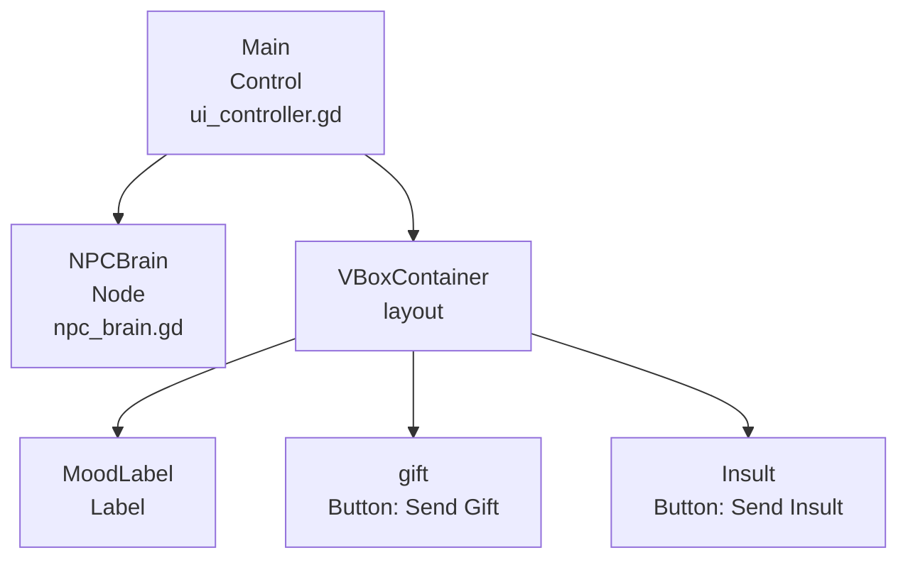
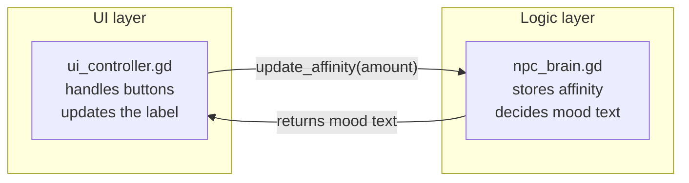
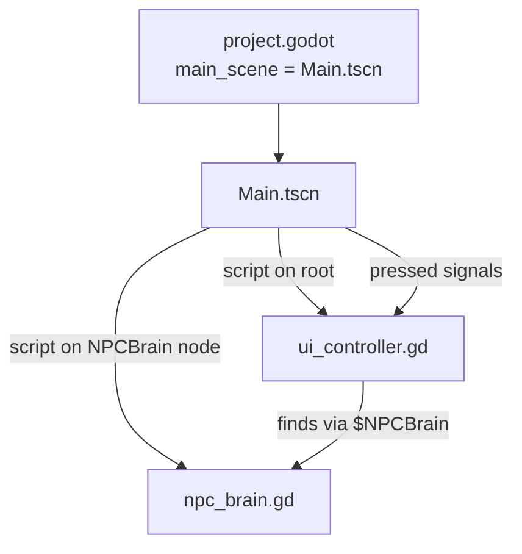
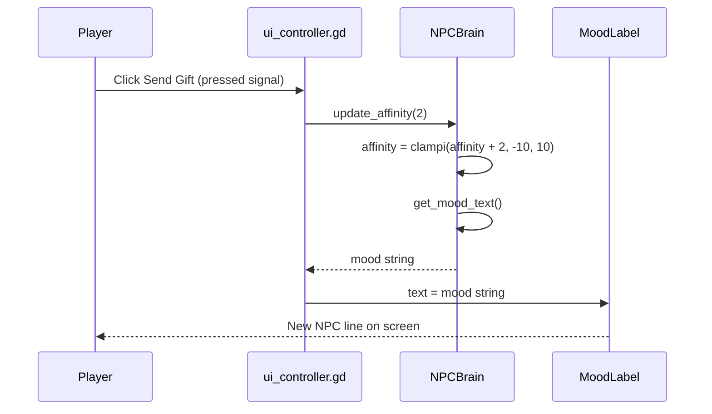
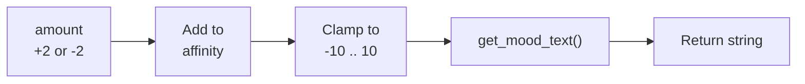
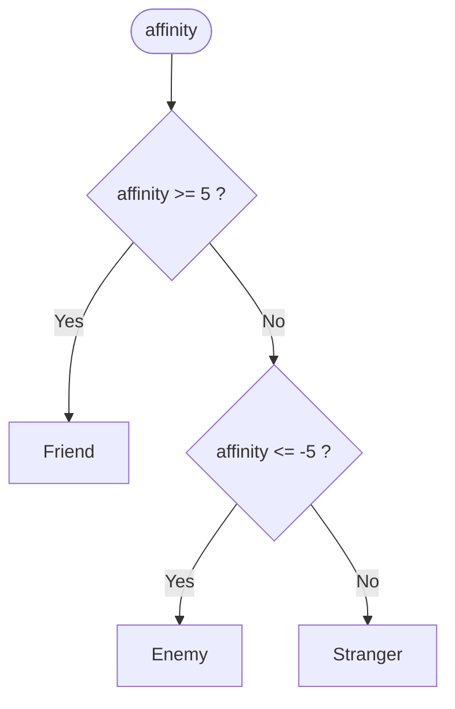
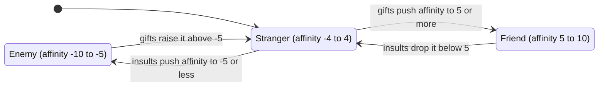
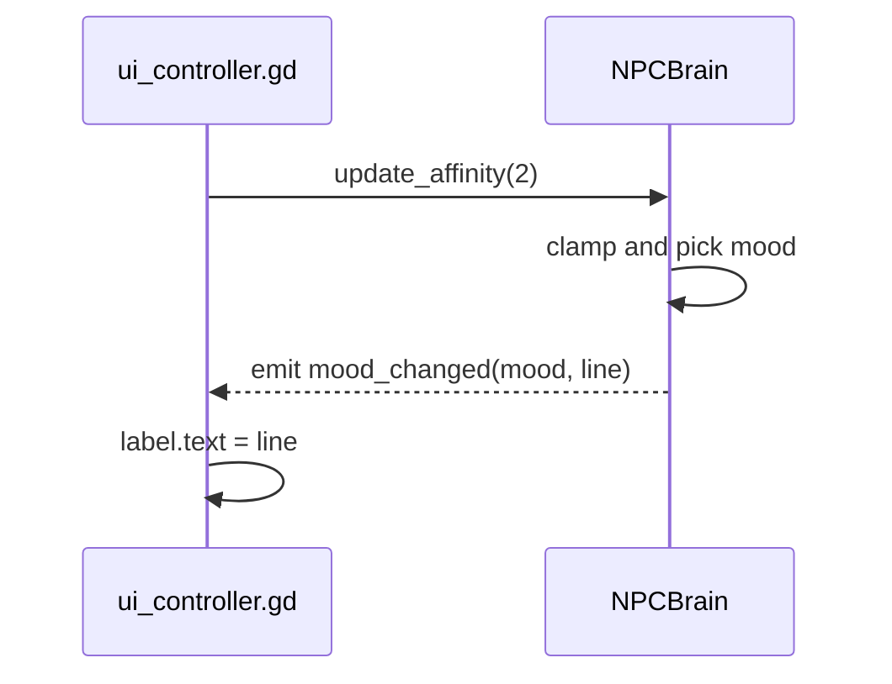
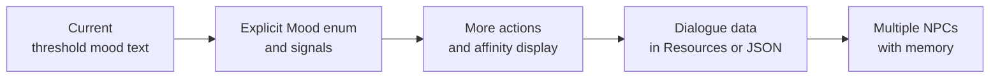

# NeuroDialogue | State-Based NPC Interaction System

A minimal **Godot 4** project showing how an NPC's mood can be driven by a single number. The player sends gifts or insults, an *affinity* score moves up or down, and the NPC's response changes when the score crosses a threshold.


---

## Table of Contents

1. [Overview](#1-overview)
2. [Architecture](#2-architecture)
3. [How It Works](#3-how-it-works)
4. [Interaction Rules](#4-interaction-rules)
5. [Requirements](#5-requirements)
6. [Quick Start](#6-quick-start)
7. [Project Structure](#7-project-structure)
8. [Code Walkthrough](#8-code-walkthrough)
9. [Configuration Reference](#9-configuration-reference)
10. [Design Notes and Known Limitations](#10-design-notes-and-known-limitations)
11. [Extending the Project](#11-extending-the-project)
12. [Roadmap](#12-roadmap)
13. [License](#13-license)

---

## 1. Overview

NeuroDialogue is a compact demonstration of three ideas that show up in most dialogue and relationship systems in games:

| Concept | How it appears here |
|---|---|
| **State from a number** | One integer, `affinity`, decides which of three moods the NPC is in |
| **Clamped values** | `clampi()` keeps affinity between -10 and 10 so it can never run away |
| **UI / logic separation** | The UI script never computes mood; it asks `NPCBrain` and displays what comes back |

The entire game is two scripts and one scene. There is no machine learning: the "brain" is a small set of rules, which is what makes it predictable and easy to extend.

---

## 2. Architecture

### 2.1 Scene tree

Everything lives in a single scene, `Main.tscn`.



### 2.2 Responsibilities



The dependency runs one way: the brain knows nothing about buttons or labels, so it can be reused with a different interface.

### 2.3 File relationships



---

## 3. How It Works

### 3.1 One button press, end to end



### 3.2 Inside `update_affinity`



### 3.3 Choosing the mood

`get_mood_text()` checks two thresholds and falls through to a default:



### 3.4 The three moods as a state diagram



### 3.5 The affinity scale

```text
Affinity: -10  -8  -6  -5  -4  -2   0   2   4   5   6   8  10
          |<---- Enemy ---->|<---- Stranger ---->|<--- Friend --->|
             (<= -5)              (-4 to 4)            (>= 5)
```

---

## 4. Interaction Rules

| Action | Affinity change | Effect |
|---|---|---|
| Send Gift | +2 | Moves toward Friendly |
| Send Insult | -2 | Moves toward Hostile |

### NPC responses

| Mood | Condition | Line shown |
|---|---|---|
| Friend | affinity >= 5 | "It's a beautiful day to see you again!" |
| Stranger | -4 to 4 | "Greetings. Can I help you with something?" |
| Enemy | affinity <= -5 | "Why are you still standing here? Leave." |

Before any button is pressed the label reads *"A stranger approaches..."*, set in `_ready()`.

### How many clicks does each mood take?

Affinity starts at 0 and always changes by exactly 2:

| Clicks from start | Gifts: affinity | Mood | Insults: affinity | Mood |
|---|---|---|---|---|
| 0 | 0 | Stranger | 0 | Stranger |
| 1 | 2 | Stranger | -2 | Stranger |
| 2 | 4 | Stranger | -4 | Stranger |
| 3 | 6 | **Friend** | -6 | **Enemy** |
| 4 | 8 | Friend | -8 | Enemy |
| 5 | 10 (cap) | Friend | -10 (cap) | Enemy |
| 6+ | 10 | Friend | -10 | Enemy |

Two consequences worth knowing:

- Because affinity is always even, the `>= 5` and `<= -5` thresholds behave like `>= 6` and `<= -6`. It takes **three** identical clicks to change mood.
- Once at a cap, the NPC has "banked" the maximum: from 10 it takes three insults to fall back to Stranger (10, 8, 6, **4**) and eight to reach Enemy.

---

## 5. Requirements

- **Godot 4.6** (the project file lists the `4.6` feature tag and the scene uses the newer `unique_id` format)
- A GPU supported by the **Forward+** renderer
- Windows uses the Direct3D 12 driver (set in `project.godot`)

No plugins, add-ons, or external dependencies.

---

## 6. Quick Start

1. Install Godot 4.6 from [godotengine.org](https://godotengine.org/download).
2. Clone the repository:

   ```bash
   git clone <your-repo-url>
   cd NeuroDialogue
   ```

3. In the Godot Project Manager, click **Import** and select **`neurodialogue/project.godot`**. The Godot project is inside the `neurodialogue/` subfolder, not the repository root.
4. Press **F5**. The main scene is already set to `res://Main.tscn`.
5. Click **Send Gift** and **Send Insult** and watch the NPC's line change.

The affinity value is not shown on screen. To see it, add `print(affinity)` inside `update_affinity` or follow [section 11.2](#112-show-affinity-on-screen).

---

## 7. Project Structure

```text
NeuroDialogue/
├── README.md
├── .gitignore
└── neurodialogue/               # Godot project root
    ├── project.godot            # Engine config (Godot 4.6, Forward+)
    ├── Main.tscn                # The only scene
    ├── icon.svg
    ├── icon.svg.import
    ├── .editorconfig
    ├── .gitattributes
    ├── .gitignore
    └── src/
        ├── npc_brain.gd         # Affinity state and mood text
        ├── npc_brain.gd.uid
        ├── ui_controller.gd     # Button handlers and label updates
        └── ui_controller.gd.uid
```

---

## 8. Code Walkthrough

### `src/npc_brain.gd`

```gdscript
extends Node
class_name NPCBrain

# State variable: -10 (Hostile) to 10 (Friendly)
var affinity: int = 0

func update_affinity(amount: int) -> String:
	affinity = clampi(affinity + amount, -10, 10)
	return get_mood_text()

func get_mood_text() -> String:
	if affinity >= 5:
		return "Friend: 'It's a beautiful day to see you again!'"
	elif affinity <= -5:
		return "Enemy: 'Why are you still standing here? Leave.'"
	else:
		return "Stranger: 'Greetings. Can I help you with something?'"
```

- `class_name NPCBrain` registers the script globally so other scripts can refer to the type.
- `update_affinity` is the brain's public API. It changes the state and returns the resulting line.
- `clampi` is the integer version of `clamp`, so the value stays in range without any manual checks.

### `src/ui_controller.gd`

```gdscript
extends Control

@onready var brain = $NPCBrain
@onready var display_label = $VBoxContainer/MoodLabel

func _ready():
	display_label.text = "A stranger approaches..."

func _on_gift_pressed() -> void:
	var response = brain.update_affinity(2)
	display_label.text = response

func _on_insult_pressed() -> void:
	var response = brain.update_affinity(-2)
	display_label.text = response
```

- `@onready` fetches child nodes once the scene tree is ready.
- The two handler functions are wired up in `Main.tscn` through `[connection]` entries, which connect each button's `pressed` signal to the root node. There is no `connect()` call in code.

### Signal wiring in `Main.tscn`

| Signal | Source node | Handler |
|---|---|---|
| `pressed` | `VBoxContainer/gift` | `_on_gift_pressed` |
| `pressed` | `VBoxContainer/Insult` | `_on_insult_pressed` |

---

## 9. Configuration Reference

Everything is a literal in code; nothing is exposed in the editor yet.

| Setting | Value | Where |
|---|---|---|
| Starting affinity | `0` | `npc_brain.gd` |
| Affinity range | -10 to 10 | `npc_brain.gd` (`clampi`) |
| Gift amount | +2 | `ui_controller.gd` |
| Insult amount | -2 | `ui_controller.gd` |
| Friend threshold | `>= 5` | `npc_brain.gd` |
| Enemy threshold | `<= -5` | `npc_brain.gd` |
| Initial label text | "A stranger approaches..." | `ui_controller.gd` |
| Renderer | Forward+ | `project.godot` |
| Windows graphics driver | Direct3D 12 | `project.godot` |
| 3D physics engine | Jolt | `project.godot` (unused by this UI-only project) |

---

## 10. Design Notes and Known Limitations

How the project relates to the patterns it names, and what to watch for:

- **The FSM is implicit.** There is no state enum, current-state variable, or transition table. The mood is *derived* from `affinity` each time `get_mood_text()` runs. This is a legitimate, lightweight approach and behaves like a three-state machine, but it is a threshold check rather than an explicit FSM. The state diagram above describes the behavior, not a data structure in the code.
- **The observer pattern is only partly used.** Button `pressed` signals connect the UI to the controller, but the brain does not emit any signals of its own. The UI gets the result from a return value. See [section 11.1](#111-let-the-brain-emit-a-signal) for a fully signal-driven version.
- **State and presentation are mixed.** `update_affinity` both changes state and returns display text, so the UI cannot learn the mood without also receiving the string.
- **Not "AI".** The behavior is fixed rules with no learning or generation. Treat the name as a nod to future intent, not a description of the current implementation.
- **Engine version mismatch in older docs.** The previous README said Godot 4.3; the project targets 4.6 and its scene format may not open in older versions.
- **Focus quirk.** The Insult button has `focus_mode = 0` (no focus), while the Send Gift button uses the default. After clicking Send Gift it keeps keyboard focus, so pressing Space or Enter will send another gift.
- **No reset.** Affinity persists until the game is restarted.
- **No persistence.** Affinity is not saved between runs.
- **No tests and no LICENSE file** are included.
- **Duplicate `.gitignore` files** exist at the repository root and inside `neurodialogue/`. Either alone would be enough.

---

## 11. Extending the Project

### 11.1 Let the brain emit a signal

This makes the UI a true observer and removes the string return value:

```gdscript
# npc_brain.gd
extends Node
class_name NPCBrain

enum Mood { ENEMY, STRANGER, FRIEND }

signal mood_changed(mood: Mood, line: String)

const MIN_AFFINITY := -10
const MAX_AFFINITY := 10
const FRIEND_AT := 5
const ENEMY_AT := -5

const LINES := {
	Mood.ENEMY: "Why are you still standing here? Leave.",
	Mood.STRANGER: "Greetings. Can I help you with something?",
	Mood.FRIEND: "It's a beautiful day to see you again!",
}

var affinity: int = 0

func get_mood() -> Mood:
	if affinity >= FRIEND_AT:
		return Mood.FRIEND
	if affinity <= ENEMY_AT:
		return Mood.ENEMY
	return Mood.STRANGER

func update_affinity(amount: int) -> void:
	affinity = clampi(affinity + amount, MIN_AFFINITY, MAX_AFFINITY)
	var mood := get_mood()
	mood_changed.emit(mood, LINES[mood])
```

```gdscript
# ui_controller.gd
func _ready():
	display_label.text = "A stranger approaches..."
	brain.mood_changed.connect(_on_mood_changed)

func _on_mood_changed(_mood, line: String) -> void:
	display_label.text = line

func _on_gift_pressed() -> void:
	brain.update_affinity(2)

func _on_insult_pressed() -> void:
	brain.update_affinity(-2)
```



The brain now has an explicit `Mood` enum, so other systems (animation, audio, quest logic) can listen for the same signal without touching the UI.

### 11.2 Show affinity on screen

Add a `ProgressBar` under `VBoxContainer` with `min_value = -10` and `max_value = 10`, then update it in the same place the label is updated:

```gdscript
@onready var bar = $VBoxContainer/ProgressBar

func _on_gift_pressed() -> void:
	display_label.text = brain.update_affinity(2)
	bar.value = brain.affinity
```

### 11.3 More actions

Turn the hard-coded amounts into data so new actions need no new logic:

```gdscript
const ACTIONS := {
	"gift": 2,
	"insult": -2,
	"compliment": 1,
	"threaten": -4,
}
```

---

## 12. Roadmap



- [ ] Add a `Mood` enum and a `mood_changed` signal
- [ ] Display affinity with a progress bar
- [ ] Move thresholds and step sizes into constants or exported variables
- [ ] Add more player actions with different weights
- [ ] Store dialogue lines as data instead of literals
- [ ] Support several NPCs with independent affinity
- [ ] Save and load relationship state
- [ ] Add a reset button

---

## 13. License

No license file is included yet. Add one (for example MIT) before publishing.
