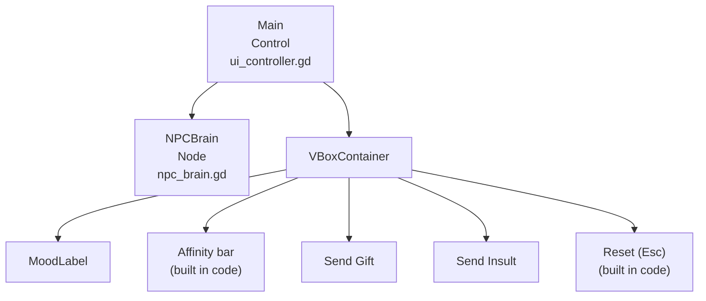
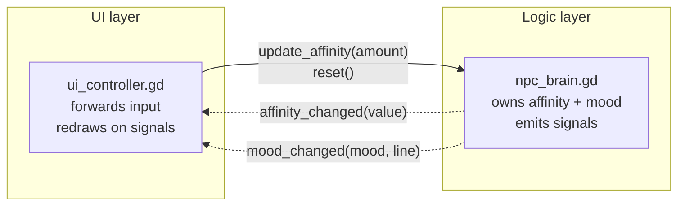
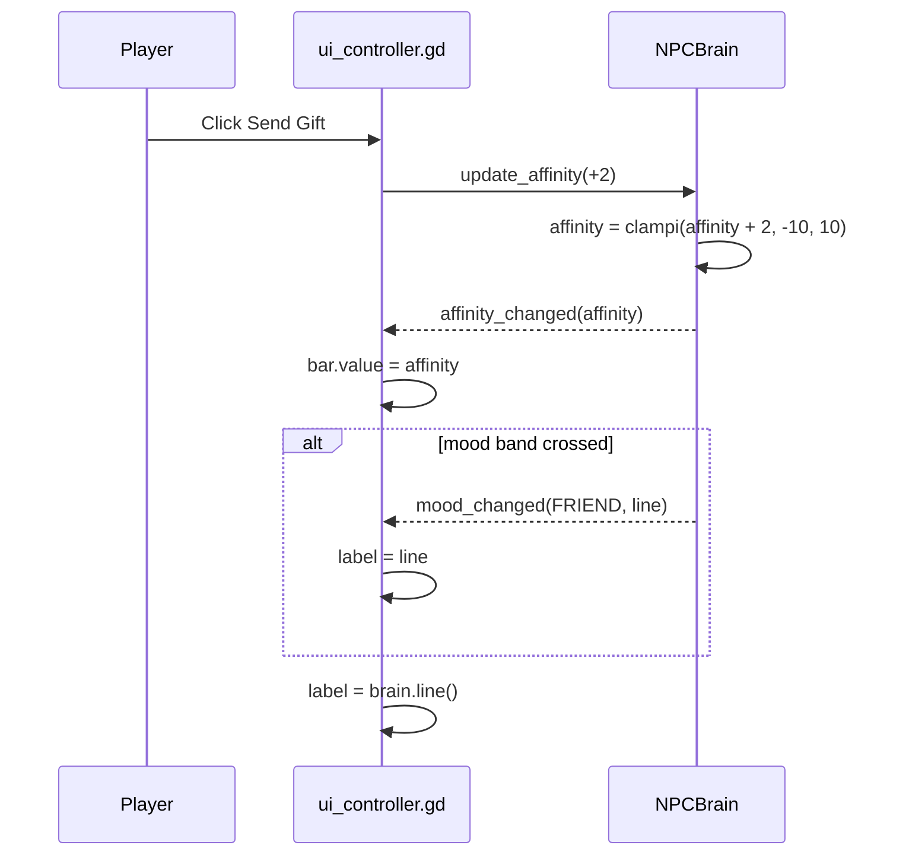
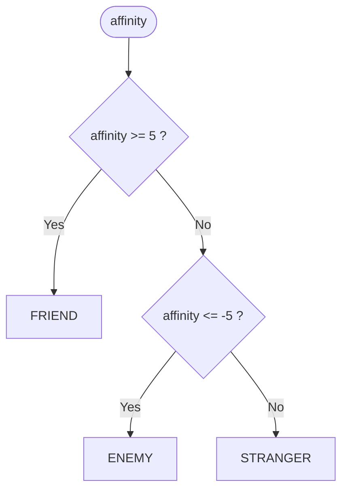
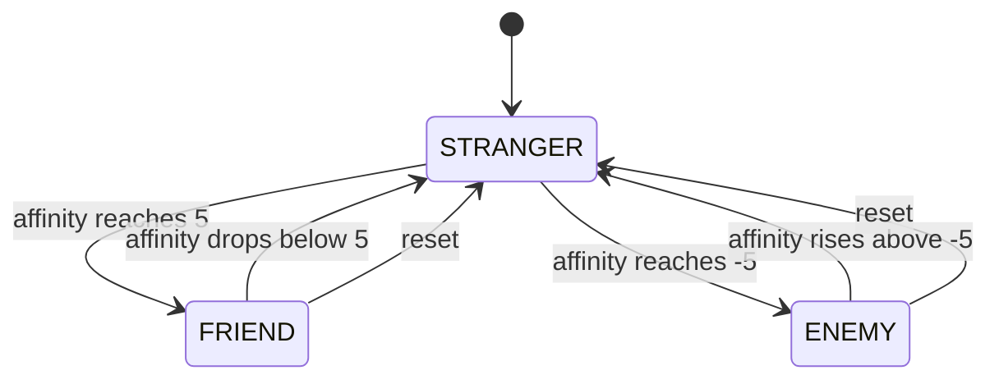

# NeuroDialogue | State-Based NPC Interaction System

A small Godot 4 project showing how an NPC's attitude toward the player can be modelled as **state driven by a single number**, with game logic and UI fully decoupled through **signals**. Be kind and the stranger becomes a friend; be rude and they turn hostile.


---

## Table of Contents

1. [Overview](#1-overview)
2. [Architecture](#2-architecture)
3. [How It Works](#3-how-it-works)
4. [Interaction Rules](#4-interaction-rules)
5. [Requirements](#5-requirements)
6. [Quick Start](#6-quick-start)
7. [Project Structure](#7-project-structure)
8. [Code Walkthrough](#8-code-walkthrough)
9. [Configuration Reference](#9-configuration-reference)
10. [Extending the Project](#10-extending-the-project)
11. [Roadmap](#11-roadmap)
12. [License](#12-license)

---

## 1. Overview

| Concept | How it appears here |
|---|---|
| **Finite state machine** | An explicit `Mood` enum (`ENEMY`, `STRANGER`, `FRIEND`) derived from one integer, `affinity` |
| **Clamped values** | `clampi()` keeps affinity between -10 and 10 |
| **Observer pattern** | `NPCBrain` emits `affinity_changed` and `mood_changed`; the UI subscribes and redraws |
| **UI / logic separation** | The brain never touches a node. Any other system (audio, animation, quests) can listen to the same signals. |

The game is two scripts and one scene, with no machine learning. The "brain" is a small set of rules, which keeps it predictable and easy to extend.

---

## 2. Architecture

### 2.1 Scene tree



The affinity bar and reset button are created in `_ready()`, which keeps `Main.tscn` minimal.

### 2.2 Responsibilities



Calls go one way and events come back the other way, so the brain can be dropped into any scene unchanged.

---

## 3. How It Works

### 3.1 One button press, end to end



`mood_changed` fires only on a real transition, so listeners such as a sound effect trigger once per change, not on every click.

### 3.2 Choosing the mood

`mood_for(value)` is a static, side-effect-free function:



### 3.3 State diagram



---

## 4. Interaction Rules

| Action | Affinity change |
|---|---|
| Send Gift | +2 |
| Send Insult | -2 |
| Reset button / Esc | back to 0 |

| Mood | Affinity range | NPC line |
|---|---|---|
| Friend | 5 to 10 | "It's a beautiful day to see you again!" |
| Stranger | -4 to 4 | "Greetings. Can I help you with something?" |
| Enemy | -10 to -5 | "Why are you still standing here? Leave." |

From a fresh start it takes **3 gifts** to become a friend (0, 2, 4, **6**) and **3 insults** to become an enemy.

---

## 5. Requirements

- **Godot 4.6** (the scene uses the 4.6 `unique_id` format)
- A GPU supported by the Forward+ renderer
- No plugins or add-ons

---

## 6. Quick Start

1. Install Godot 4.6 from [godotengine.org](https://godotengine.org/download).
2. Clone the repository:

   ```bash
   git clone https://github.com/JoshuaOmosa/NeuroDialogue.git
   ```

3. In the Godot Project Manager, click **Import** and choose **`neurodialogue/project.godot`**. The Godot project lives in that subfolder.
4. Press **F5**.
5. Click **Send Gift** / **Send Insult**, watch the line and the affinity bar change, and press **Esc** to start over.

---

## 7. Project Structure

```text
NeuroDialogue/
├── README.md
├── LICENSE
└── neurodialogue/               # Godot project root
    ├── project.godot
    ├── Main.tscn                # The only scene
    └── src/
        ├── npc_brain.gd         # State, thresholds, signals
        └── ui_controller.gd     # Input forwarding and redraw
```

---

## 8. Code Walkthrough

### `src/npc_brain.gd`

```gdscript
enum Mood { ENEMY, STRANGER, FRIEND }

signal affinity_changed(affinity: int)
signal mood_changed(mood: Mood, line: String)

static func mood_for(value: int) -> Mood:
	if value >= FRIEND_AT:
		return Mood.FRIEND
	if value <= ENEMY_AT:
		return Mood.ENEMY
	return Mood.STRANGER

func _set_affinity(value: int) -> void:
	affinity = value
	affinity_changed.emit(affinity)
	var new_mood := mood_for(affinity)
	if new_mood != mood:
		mood = new_mood
		mood_changed.emit(mood, line())
```

All writes go through `_set_affinity`, so `update_affinity()` and `reset()` can't forget to emit.

### `src/ui_controller.gd`

```gdscript
func _ready() -> void:
	_build_extra_controls()
	brain.affinity_changed.connect(_on_affinity_changed)
	brain.mood_changed.connect(_on_mood_changed)

func _on_gift_pressed() -> void:
	_respond(GIFT_AMOUNT)
```

The controller holds no game state. It forwards input and reacts to signals.

### Signal wiring

`Main.tscn` connects each button's `pressed` signal to `_on_gift_pressed` / `_on_insult_pressed`. Both buttons have `focus_mode = 0`, so pressing Space or Enter can't repeat the last action by accident.

---

## 9. Configuration Reference

| Constant | Value | File |
|---|---|---|
| `MIN_AFFINITY` / `MAX_AFFINITY` | -10 / 10 | `npc_brain.gd` |
| `FRIEND_AT` | 5 | `npc_brain.gd` |
| `ENEMY_AT` | -5 | `npc_brain.gd` |
| `GIFT_AMOUNT` / `INSULT_AMOUNT` | 2 / -2 | `ui_controller.gd` |
| `LINES` | one line per mood | `npc_brain.gd` |

---

## 10. Extending the Project

**React to mood changes elsewhere.** Any node can subscribe without touching the brain or the UI:

```gdscript
func _ready():
	$NPCBrain.mood_changed.connect(func(mood, _line):
		if mood == NPCBrain.Mood.ENEMY:
			$AngrySound.play())
```

**Add a new action.** Add a button, connect its `pressed` signal, and call `_respond(amount)` with the weight you want (a compliment might be `+1`, a threat `-4`).

**Load lines from data.** Replace `LINES` with a `Resource` or JSON file so writers can edit dialogue without touching code.

---

## 11. Roadmap

- [x] Explicit `Mood` enum with `mood_changed` / `affinity_changed` signals
- [x] On-screen affinity bar
- [x] Thresholds and weights as named constants
- [x] Reset button and Esc shortcut
- [ ] Dialogue lines loaded from a Resource
- [ ] Several NPCs with independent affinity
- [ ] Save and load relationship state
- [ ] GUT unit tests for `mood_for()` and clamping

---

## 12. License

MIT. See [LICENSE](LICENSE).
